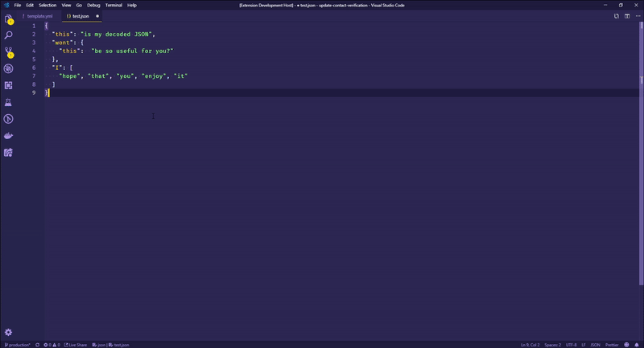

# b64toString

## Features

Converts between base64 and JSON, simply select the text you want to convert, open the Command Palette and select either
```Base64 Encode``` to encode the selected JSON to base64 or select ```Base64 Decode``` to decode the selected string to JSON.

